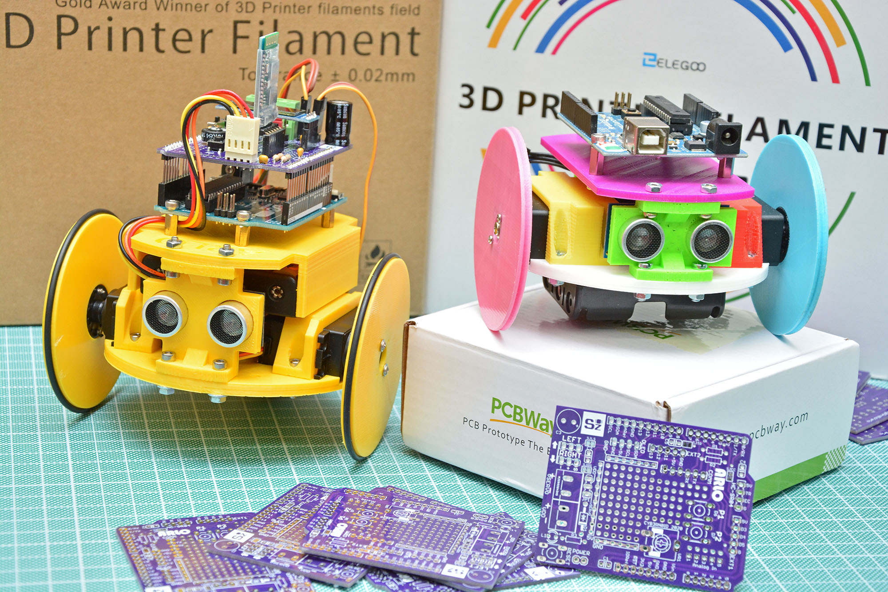

  

  

# AR.L.O.
AR.L.O. Stands for ARduino Loaded with O-rings! It's an educational Arduino-based robot with a chassis printed in 3D. It features an ultrasonic range finder SR-HC04, an 0.91" OLED display, an HC-05 or HC-06 Bluetooth Module and two modified Servos (MG996R) for moving around.  I provided full-assembly instructions on my blog (see link at the end of this readme). Here you can find the STL to be printed and a source code.  Source code uses interrupts for make robot movement more efficient.

### PCBs by PCBWay
You can support my work by subscribing to PCBWay [using my invite link](https://www.pcbway.com/setinvite.aspx?inviteid=355653&from=settorezero2020) and then making AR.L.O. PCBs on PCBWay:   

### Links
- [Full Instructions](https://www.settorezero.com/wordpress/arlo)
- [BOM (Google Spreadheet with links)](https://docs.google.com/spreadsheets/d/1MPQHllO7yKMDYPbDrZOl-8qmw7OP9y3tJf0Bnw-yMyg/)
- [AR.L.O. video teaser](https://www.youtube.com/watch?v=O_3CUWvaW3k)
- [Video about AR.L.O. (only for italian users)](https://www.youtube.com/watch?v=JS_QYEIMfNo)
- [Video showing AR.L.O. setup](https://youtu.be/i7roltk-IzI)
- [AR.L.O. parts on Thingiverse](https://www.thingiverse.com/thing:4484651)
- [Servo Wheel by Obijuan](https://www.thingiverse.com/thing:19940)
- [Support my work by subscribing to PCBWay using my invite link](https://www.pcbway.com/setinvite.aspx?inviteid=355653&from=settorezero2020)
- [Support my work buying parts on Futura Elettronica after you've clicked on this link](https://www.futurashop.it/?tracking=5f004a6ba8be7)
